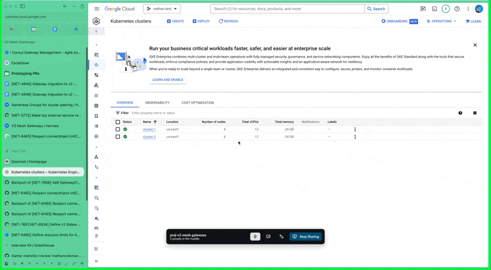

### Install

Limitations:
- Must install Consul into the `default` namespace
- ACLs must be disabled

#### Prepare Kubernetes Clusters

The Kubernetes clusters need to be on a "flat" network, meaning that all IPs in cluster-1 are accessible from cluster-2 and vice versa.

The assumption below is that the kubecontext for the default partition will be named `cluster-1` and the kubecontext for the other partition will be named `cluster-2`.

##### cluster-1
```shell
$ gcloud container clusters create cluster-1 --num-nodes=2 --enable-ip-alias --create-subnetwork name="gke-cluster-1-subnet-b6526050"
...

$ helm upgrade --install consul /<path-to-consul-k8s>/charts/consul --values ./values-default.yaml
```

##### cluster-2
Note that we use the subnetwork created for cluster-1 above.

```shell
$ gcloud container clusters create cluster-2 --num-nodes=2 --enable-ip-alias --subnetwork=gke-cluster-1-subnet-b6526050
...

$ kubectl get secret consul-ca-cert --context cluster-1 --output yaml | kubectl apply --context cluster-2 --filename -
$ kubectl get secret consul-ca-key --context cluster-1 --output yaml | kubectl apply --context cluster-2 --filename -
```

You'll then need to set a firewall rule to allow traffic between the pods of each cluster.



Now, you'll need to collect two IP addresses that are required for connecting to external Consul servers and plug them into `values-other.yaml` before Helm install.

###### Host IP
Grab the external IP of the `consul-expose-servers` Kubernetes service.

```shell
$ kubectl --context=cluster-1 get service consul-expose-servers -o wide
```

Now insert that value as a single-item list in `values-other.yaml` at `externalServers.hosts`.

###### K8s Auth Method Host IP
Grab the scheme and address (`https://<ip>`) from the output below.

```shell
$ kubectctl --context=cluster-2 cluster-info
```

Now insert that value into `values-other.yaml` at `externalServers.k8sAuthMethodHost`.

##### Helm Install
Compute the Helm install using the context for cluster-2.

```shell
$ helm upgrade --install consul /<path-to-consul-k8s>/charts/consul --values ./values-other.yaml
```

#### Apply Kubernetes Resources

```shell
$ kubectl --context=cluster-2 apply -f resources/other-partition/
$ kubectl --context=cluster-1 apply -f resources/default-partition/
```