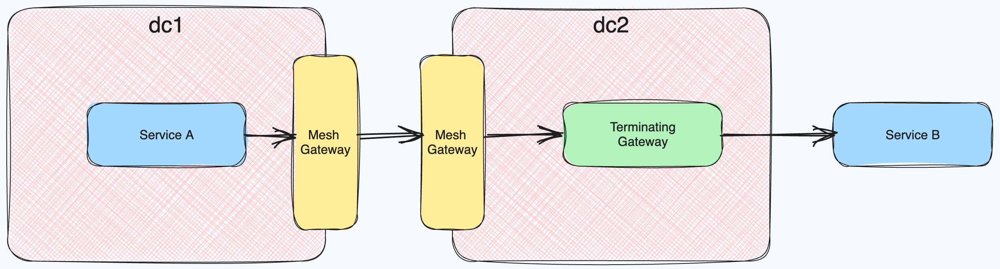

This setup uses mesh and terminating gateways together.
- `dc1` and `dc2` are peered clusters.
- Service B is configured as an external endpoint reachable via the terminating gateway
- Service B is exported from `dc2` to `dc1`
- Service B should be reachable from Service A

### Prepare

I generally use GKE, so the commands below reference the `gcloud` CLI for creating clusters.

#### Prepare dc1

> [!NOTE] It's helpful to rename your kube context to `dc1` after running `get-credentials`

```shell
$ gcloud container clusters create dc1 --region=us-east1 --num-nodes=2
$ gcloud container clusters get-credentials dc1
$ helm upgrade --install consul hashicorp/consul --namespace=consul --create-namespace --values=values-dc1.yaml
$ kubectl apply --filename dc1
```


#### Prepare dc2

> [!NOTE] It's helpful to rename your kube context to `dc2` after running `get-credentials`

```shell
$ gcloud container clusters create dc2 --region=us-east1 --num-nodes=2
$ gcloud container clusters get-credentials dc2
$ helm upgrade --install consul hashicorp/consul --namespace=consul --create-namespace --values=values-dc2.yaml
$ kubectl --context=dc1 get secret peering-token -n consul -o yaml | kubectl --context=dc2 apply -n consul -f -
$ kubectl apply --filename dc2
```