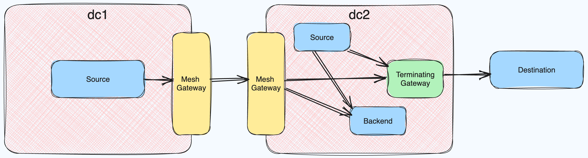

This setup uses mesh and terminating gateways together.
- `dc1` and `dc2` are peered clusters.
- `destination` is configured as an external endpoint reachable via the terminating gateway
- `backend` is a service on the mesh
- `destination` and `backend` are exported from `dc2` to `dc1`
- `destination` and `backend` should be reachable from `source` in both `dc1` and `dc2`

### Prepare

> [!NOTE]
> I generally use GKE, so the commands below reference the `gcloud` CLI for creating clusters.

#### Prepare dc1

> [!TIP]
> It's helpful to rename your kube context to `dc1` after running `gcloud container clusters get-credentials`. This makes subsequent `kubectl` commands that need to specify the context(s) easier to write and read.

```shell
$ gcloud container clusters create dc1 --region=us-east1 --num-nodes=2
$ gcloud container clusters get-credentials dc1
$ helm upgrade --install consul hashicorp/consul --namespace=consul --create-namespace --values=values-dc1.yaml
$ kubectl apply --filename resources/dc1
```


#### Prepare dc2

> [!TIP]
> It's helpful to rename your kube context to `dc2` after running `gcloud container clusters get-credentials`. This makes subsequent `kubectl` commands that need to specify the context(s) easier to write and read.

```shell
$ gcloud container clusters create dc2 --region=us-east1 --num-nodes=2
$ gcloud container clusters get-credentials dc2
$ kubectl create namespace consul
$ kubectl --context=dc1 get secret peering-token-dc2 -n consul -o yaml | kubectl --context=dc2 apply -n consul -f -
$ helm upgrade --install consul hashicorp/consul --namespace=consul --values=values-dc2.yaml
$ kubectl apply --filename resources/dc2
```

From here, follow https://developer.hashicorp.com/consul/docs/k8s/connect/terminating-gateways

> [!TIP]
> You can register the service node using stdin: `curl --request PUT --data @-` and then hit ctrl+d once you've pasted in `external-service.json`.

### Test

To test, we shell into the __source__ container and call our upstream.
It's important that we set the `Host` header to avoid getting a `421 Misdirected Request` from Cloudflare.

```shell
$ curl --silent -H "Host: jsonplaceholder.typicode.com" http://localhost:1234/todos/1 | jq
```